# Druck-Konfigurator – Handbuch

Der Druck-Konfigurator berechnet passende Startwerte für den **Anycubic Kobra S1 (Combo)** und den **Snapmaker U1** und schreibt sie direkt in eine Projektdatei für **OrcaSlicer**. Du lädst ein Modell, das Tool prüft Maße und Überhänge, schlägt die beste Lage auf dem Bett vor und liefert eine 3MF-Datei, die in Orca sofort mit den richtigen Werten öffnet.

Alles läuft lokal in deinem Browser. Es werden keine Modelle oder Daten ins Internet geschickt.

> **Hinweis:** Alle Werte sind Startwerte ohne Gewähr. Filamente unterscheiden sich je nach Hersteller und Charge – die Angaben auf der Rolle haben Vorrang. Die Slicer-Vorschau immer prüfen. Nutzung auf eigene Verantwortung – den vollständigen **Haftungsausschluss** findest du in der [README](README.md#haftungsausschluss) und im Tool unter **? → Haftungsausschluss**.

---

## Inhalt

1. [Installation und Start](#1-installation-und-start)
2. [Die Oberfläche](#2-die-oberfläche)
3. [Modell laden](#3-modell-laden)
4. [Mehrere Teile](#4-mehrere-teile)
5. [Lage auf dem Bett](#5-lage-auf-dem-bett)
6. [Einstellungen und Datenblatt](#6-einstellungen-und-datenblatt)
7. [Eigene Filamentwerte und Profile](#7-eigene-filamentwerte-und-profile)
8. [Drucker-Verbindung (Filament-Belegung live)](#8-drucker-verbindung-filament-belegung-live)
9. [3MF für OrcaSlicer speichern](#9-3mf-für-orcaslicer-speichern)
10. [Makerworld-Projekte umstellen](#10-makerworld-projekte-umstellen)
11. [3D-Ansicht](#11-3d-ansicht-schritt--modell)
12. [Grenzen und bekannte Einschränkungen](#12-grenzen-und-bekannte-einschränkungen)
13. [Probleme lösen](#13-probleme-lösen)

---

## 1. Installation und Start

**Als Container (empfohlen für die Drucker-Verbindung):** auf dem NAS oder Heimserver im Projektordner `docker compose up -d --build`, dann im Browser `http://<IP-des-NAS>:8765/` – von jedem Gerät im Heimnetz. Ohne weitere Einstellung hat die Seite keine Anmeldung: nur im Heimnetz betreiben, nicht ins Internet freigeben. Mit `KONFIGURATOR_PIN` (4–32 Zeichen, in `docker-compose.yml`) fragt sie nach einer **PIN**; die Anmeldung gilt 30 Tage, nach 5 Fehlversuchen ist sie für 5 Minuten gesperrt. Eigene Filamentwerte speichert weiterhin jeder Browser für sich (über **Profile exportieren/importieren** übertragen).

**Als Home-Assistant-Add-on:** Repository `https://github.com/TMA84/ha-addons` hinzufügen, **Druck-Konfigurator** installieren, in der Konfiguration die **Drucker-IP** eintragen. Das Tool erscheint in der Seitenleiste (geschützt durch die Anmeldung von Home Assistant). Den optionalen direkten Port 8765 schützt die Option **access_pin**. Mehr unter [Home Assistant](#home-assistant).

**Tablet:** Die Seite passt sich an Tablets an (Hoch- und Querformat); im Tab **Drucker** sind Knöpfe, Achsen und Regler für Finger groß genug.

**Online:** https://wolfb63-del.github.io/druck-konfigurator/ – ohne Download, auch auf Mac, Linux und Tablet. Die Live-Abfrage vom Drucker geht dort nicht; „Belegung eintragen“ schon. Eigene Filamentwerte speichert der Browser getrennt von der heruntergeladenen Version.

**Voraussetzungen:** Windows, macOS oder Linux mit einem aktuellen Browser (Chrome, Edge, Firefox oder Safari) und OrcaSlicer. Getestet ist Windows mit Chrome; auf Mac und Linux sollte es genauso laufen. **Keine Installation nötig.** Nur wer die Filament-Belegung live vom Drucker lesen will (Rinkhals/Moonraker), braucht zusätzlich [Python](https://www.python.org) (Version 3.8 oder neuer).

1. Das Projekt als ZIP herunterladen (auf GitHub: **Code → Download ZIP**) und in einen Ordner entpacken, z. B. `C:\Druck-Konfigurator`.
2. Starten – zwei Möglichkeiten:
   - **Normal:** Doppelklick auf **`index.html`**. Alles funktioniert; die Filament-Belegung trägst du einmal im Export-Dialog ein (siehe [Kapitel 9](#9-3mf-für-orcaslicer-speichern)).
   - **Mit Live-Abfrage** (nur Rinkhals/Moonraker, braucht Python): unter Windows Doppelklick auf **`Konfigurator starten.cmd`**; unter Mac/Linux im Projektordner im Terminal `python3 tools/serve.py` eingeben und im Browser `http://127.0.0.1:8765` öffnen. Es öffnet sich ein schwarzes Fenster (lokaler Webserver) und der Browser mit dem Tool. Das Fenster offen lassen, solange du das Tool benutzt. Der Server ist nur auf deinem PC erreichbar. Direkt geöffnet (`index.html`) blockiert der Browser die Antworten der Drucker.

> Deine eigenen Filamentwerte speichert der Browser getrennt je Startart. Bleib deshalb bei einer Startart – oder übertrage die Werte über **⚙ Einstellungen → Profile exportieren/importieren**.

---

## 2. Die Oberfläche

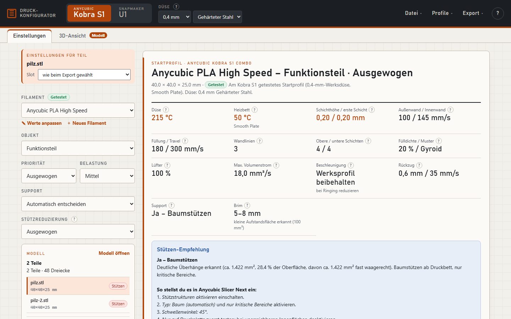

- **Kopfzeile:** Drucker umschalten (**Kobra S1** / **Anderer Anycubic …**), Düsengröße und Düsenmaterial. Zurzeit bietet das Tool nur Anycubic-Drucker an; der Snapmaker U1 und die übrigen Hersteller sind ausgeblendet (`index.html?alle-drucker` zeigt sie).
- **Sprache und Darstellung** (oben rechts): **DE / EN** stellt die Oberfläche auf Deutsch oder Englisch um (ohne Auswahl nach Browsersprache). **☀ / A / ☾** wählt hell, automatisch (wie das System) oder dunkel. Beides merkt sich der Browser.

### Anderer Anycubic-Drucker

Über **Anderer Anycubic …** wählst du aus den Anycubic-Druckern der OrcaSlicer-Profile (z. B. Kobra 3, Kobra S1 Max, Kobra X). Namen eintippen, Drucker mit passender Düse anklicken. (Mit `index.html?alle-drucker`: rund 990 Drucker von 63 Herstellern.)

- **Geschwindigkeiten, Beschleunigung und Volumenstrom** höchstens so hoch wie im OrcaSlicer-Profil des Druckers – ein langsamer Drucker bleibt bei seinen Werten, TPU trotzdem langsam.
- **Temperaturen und Materialwerte** stammen aus den Tests am Kobra S1 und gelten hier als allgemeine Startwerte.
- Die **3MF** enthält Druckerprofil, Prozessprofil und passende Filamentprofile des Herstellers aus OrcaSlicer; Orca lädt beim Öffnen genau diese Profile.
- Heizt der Start-G-Code eines Herstellerprofils fest auf eine Temperatur (bei rund 20 Profilen, z. B. LONGER LK10), warnt das Datenblatt – Orca würde sonst mit dieser festen Temperatur drucken.
- Kobra S1 und U1 nutzen weiterhin deine eigenen Orca-Vorlagen und die Live-Abfrage.
- **Arbeitsschritte (Registerkarten)** – der Reihe nach von links nach rechts:

  | Schritt | Inhalt |
  |---|---|
  | **① Modell** | große 3D-Ansicht; daneben Teileliste, Lage auf dem Bett, Mehrfarbig, Bohrlöcher |
  | **② Druckwerte** | je Teil Filament, Objektart, Priorität, Belastung, Support – rechts das Datenblatt; die lange Liste „Einstellungen in OrcaSlicer-Reihenfolge“ ist eingeklappt |
  | **③ Slicen & Kosten** | Kosten (automatisch neu berechnet), Ausgabe (**Drucken …**, **3MF für OrcaSlicer speichern**), Filament-Slots, Spülmenge – rechts die Slice-Vorschau |
  | **④ Drucker** | Werkbank: Druckauftrag, Kamera, Temperaturen, Achsen, ACE |

  Die Registerkarte **① Modell** zeigt „geladen“, **③** den Gesamtpreis, **④** den Druckfortschritt. Die Pfeiltasten ←/→ wechseln zwischen den Schritten.
- **Menüs:**
  - **Datei** – Modell öffnen, Modell entfernen, 3MF für OrcaSlicer; unter **Weitere Exporte** Filament-/Process-JSON, Datenblatt drucken/als PDF, Datenblatt als Text kopieren
  - **⚙ Einstellungen** – *Filamente* (Werte anpassen, neues Filament, eigene Profile, Import/Export), *Drucker* (Drucker-Verbindung, Düsen-Umrechnung), *Farben & Kosten* (Filament-Slots, Farbwechsel & Spülmenge, Preise & Sätze)
  - **?** – Kurzhilfe
- Neben vielen Werten steht ein **?** – mit der Maus darauf zeigen (oder antippen) für eine Erklärung.

---

## 3. Modell laden

Über **Datei → Modell öffnen** oder einfach per Drag & Drop ins Fenster. Möglich sind:

| Datei | Was passiert |
|---|---|
| **STL** | Wird eingelesen; stecken mehrere getrennte Körper darin, werden sie als einzelne Teile erkannt. |
| **mehrere STLs** | Alle zusammen als ein Projekt mit Teileliste. |
| **3MF** | Objekte, Platten und Slot-Zuweisung werden übernommen (Modifier und Hilfskörper werden nicht als Teil gezählt). |
| **ZIP** (z. B. von Makerworld) | Wird entpackt. Liegt genau eine 3MF darin, wird diese verwendet, sonst alle STLs. |

Körper, die sich berühren oder überlappen, bleiben ein Teil – z. B. Hohlkörper oder unverschmolzene Exporte aus Tinkercad.

---

## 4. Mehrere Teile

**Filamente (wie in OrcaSlicer):** Oben in der Modellkarte stehen die **Slots am Drucker** als Farbfelder (Nummer, Material, wie viele Teile ihn nutzen; ★ = Standard-Slot). Ein Klick legt den Slot auf das gewählte Teil. Bei Makerworld-/Orca-3MF steht darüber **Modell → Slot**: jedes Filament des Designers mit Farbe, Nummer und Material und der Slot deiner ACE, auf den es gedruckt wird – anklicken zum Umlegen, **Automatisch** legt jede Farbe auf den ähnlichsten Slot mit passendem Material (PLA nicht neben ASA/ABS), **Wie vom Designer** nimmt das zurück. Hat das Modell mehr Farben als du Slots hast (z. B. Mario mit 7 Farben), legt das Tool die überzähligen beim Laden gleich auf passende Slots. **Slotfarben / Designer** schaltet die 3D-Ansicht zwischen „so wird gedruckt“ und den Farben des Designers um.

**Teileliste:** Jede Zeile hat vorne einen farbigen **Slot-Chip** (gestrichelt = Standard-Slot aus dem Export-Dialog); Klick → Slot wählen. Das **Filament in ② Druckwerte folgt dem Slot** (Material aus der ACE, bei verknüpfter Spule deren Profil) – außer du wählst dort selbst eines. Die gewählte Zeile zeigt darunter **Platte** und **Anzahl** und die **Farben im Teil**: Grundkörper, Körper, Farb-Modifikatoren des Designers (z. B. ein Schriftzug), erhabene Beschriftung – jeweils mit eigenem Chip. Liegt eine Farbe nur in den ersten Schichten, steht „von unten sichtbar“ dabei.

**Werkzeugleiste (3D-Ansicht, wie in OrcaSlicer):** Rückgängig / Wiederholen (auch Strg/⌘+Z, Strg/⌘+Umschalt+Z, bis 60 Schritte: Slot, Größe, Drehung, Platte, Kopien, Entfernen, Farbzuordnung …) · Modell hinzufügen, gewähltes Teil auf eine neue Platte, alle Teile ausrichten, platzsparend anordnen · Kopie + / −, in Teile trennen, entfernen · Fläche aufs Bett, drehen (90° um X/Y/Z), Größe, Schnitt, Text, messen · ganze Platte, Drahtgitter, Achsen. Ausgegraut ist, was für das gewählte Teil nicht geht – der Tooltip nennt den Grund. Auch Teile einer Makerworld-3MF lassen sich drehen, auf eine neue Platte legen und in ihre Körper trennen (die Datei des Designers bleibt, Drehung und Größe stehen in der Transformation des Objekts); ohne Zutun bleibt die Lage des Designers. Auch Beschriftung geht dort – der Text wird ein weiteres Bauteil des Objekts (erhaben mit eigenem Slot, vertieft als negatives Teil).

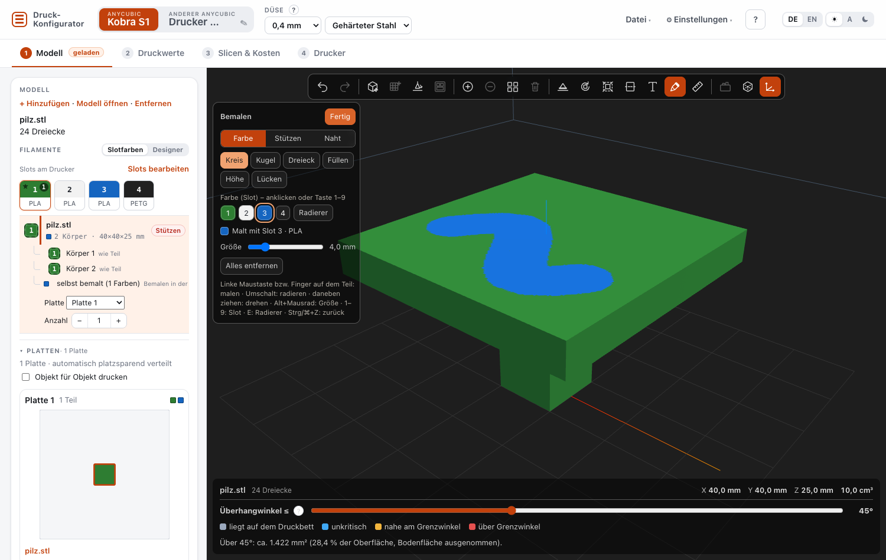

**Bemalen** (Pinsel in der Werkzeugleiste, wie das Mal-Werkzeug in OrcaSlicer): Links erscheint ein Feld. **Farbe** = Slot: eines der Farbfelder 1, 2, 3 … anklicken oder die Taste 1–9 drücken – darunter steht, mit welchem Slot gerade gemalt wird (hat ein Slot keine Farbe, zeigt das Tool eine Ersatzfarbe, dieselbe wie in der 3D-Ansicht). **Werkzeuge:** *Kreis* malt, was unter dem Kreis zur Kamera zeigt; *Kugel* alles innerhalb der Kugel; *Dreieck* ganze Dreiecke ohne Teilen; *Füllen* eine zusammenhängende Fläche bis zu Kanten, die steiler als der eingestellte Winkel sind (90° = ganzer Quader); *Höhe* alles in einer Höhe. Malen mit gedrückter linker Maustaste (Handy: Finger) auf dem Teil, **Umschalt** oder *Radierer* (Taste E) nimmt Farbe weg, **Alt+Mausrad** ändert die Größe; neben dem Teil gezogen dreht sich die Ansicht wie sonst. *Alles entfernen* löscht die ganze Bemalung des Teils (auch die des Designers), Strg/⌘+Z nimmt jeden Strich zurück. Kreis und Kugel teilen Dreiecke am Rand fein auf, wie OrcaSlicer – gespeichert wird im Orca-Format, der Export druckt genau die bemalte Fläche. Die Bemalung gilt für alle Kopien bzw. Platzierungen desselben Objekts. Bei Makerworld-Modellen bleibt die Bemalung des Designers erhalten; wo du malst, gilt deine Farbe (die Zuordnung „Modell → Slot“ ändert diese Stellen danach nicht mehr – ein Hinweis erinnert daran).

Oben im Feld wählst du, **was** gemalt wird: **Farbe**, **Stützen** oder **Naht** (wie die drei Mal-Werkzeuge in OrcaSlicer). *Stützen:* **Erzwingen** (grün) druckt dort Stützen, **Verhindern** (violett) keine – auch wenn Orca sonst welche setzen würde; die Überhangfarben bleiben dabei sichtbar. Hat das Teil sonst keine Stützen, stellt der Export es auf „Stützen nur an gemalten Stellen“ (tree(manual)) – Orca beachtet erzwungene Stützen nur so. *Naht:* **Naht hier** legt die Naht bevorzugt auf die gemalte Fläche, **Keine Naht** hält sie davon fern. Tasten 1 und 2 wählen die Markierung, E den Radierer. **Lücken** füllt kleine unbemalte Stellen (bis zur eingestellten Fläche in mm²) mit der Farbe ringsum, wie „Gap fill“ in Orca – offene Flächen zum unbemalten Rest bleiben. Beim **Füllen** zeigt eine helle Fläche unter der Maus vorher, was gefüllt wird. Jeder Strich slict im Tab ③ neu.

**STL-Einheit:** STL-Dateien haben keine Einheit. Ist eine Datei in Meter gespeichert (z. B. aus Blender oder Onshape; das Teil wäre kleiner als 0,5 mm), rechnet das Tool sie beim Laden auf Millimeter um und sagt es. Ist ein Teil höchstens 10 mm groß, kann die Datei auch in Zoll sein – dann bietet das Tool unter dem Modell **In Zoll umrechnen (×25,4)** an (mit Rückgängig) oder **Passt so**.

**Größe** (Abschnitt in der Modellkarte oder Werkzeugleiste): Skalierung in Prozent oder Zielmaß je Achse in mm; **gleichmäßig** aus = jede Achse einzeln. **Bauraum füllen** macht das Teil so groß wie möglich, **Original** stellt die Größe aus der Datei wieder her. Skaliert wird um die Mitte der Grundfläche – das Teil bleibt auf dem Bett. Kopien ändern sich mit. Bei Makerworld-3MF bleibt die Datei des Designers, die Größe steht in der Transformation des Objekts (Modifikatoren und Bemalung wachsen mit). Beschriftungen bleiben an ihrer Stelle und behalten ihre Schrifthöhe; gewählte Bohrlöcher bleiben gewählt (sie werden im neuen Netz wiedergefunden, auch nach einer Drehung).

**Objekt für Objekt drucken** (unter **Platten**): Der Drucker druckt jedes Teil ganz fertig, bevor er das nächste beginnt (Orca: Druckreihenfolge „nach Objekt“) – weniger Fahrwege und Fäden zwischen Teilen, ein Fehldruck betrifft nur ein Teil. Die Teile bekommen dafür den Freiraum des Druckkopfs als Abstand (Kobra S1: 60 mm), Platten einer Makerworld-3MF werden dafür neu angeordnet. Höchstens ein Teil je Platte darf höher sein als der Abstand bis zur X-Achse (S1: 48 mm) – sonst warnt die Plattenübersicht.

**Druckt aus** (② Druckwerte, unter „Einstellungen für Teil“): alle Slots, aus denen das gewählte Teil druckt – Grundkörper, Körper, Bemalung, Modifikatoren, Beschriftung. Die Druckwerte des Teils gelten für alle diese Slots; liegt in einem davon eine andere Filamentart, erscheint eine Warnung.

**Modell entfernen:** In der Modellkarte **Entfernen** – bei mehreren hinzugefügten Modellen auch nur eines davon; **Rückgängig** in der Meldung holt es zurück. **Neuladen der Seite:** Das geladene Projekt samt allen Einstellungen bleibt erhalten (im Browser gespeichert).

**3D-Ansicht:** **Ganze Platte** zeigt alle Teile der Platte des gewählten Teils an ihrem Platz (auch die Platten einer Makerworld-3MF). Bemalung und Farb-Modifikatoren des Designers erscheinen in ihren Farben, sehr dunkle Filamente etwas aufgehellt. Die Modellkarte zeigt oben die **Teile** (je Teil eine Zeile: Slot, Name, Punkt für Stützen grün/gelb/rot; beim gewählten Teil Platte, Körper und Anzahl). Kopien eines Teils stehen in einer Zeile („×20“). Besteht ein Modell aus mehreren Teilen (eine Datei, mehrere Stücke), steht darüber eine Kopfzeile mit der **Anzahl für das ganze Modell** – z. B. 20 Sätze aus Halter und Deckel, darunter die einklappbaren **Filamente** und die **Werkzeuge für das gewählte Teil** als Reiter – **Platten, Lage, Größe, Farben, Bohrlöcher, Text**, immer einer offen, mit Kurzinfo (z. B. „4 Platten“, „150 %“). Hinweise vom Import stehen in einer Zeile (ℹ, anklicken zeigt alles).

Bei mehreren Teilen erscheint im Schritt **① Modell** eine **Teileliste**. Jede Zeile zeigt Name, Maße, Slot und ob das Teil Stützen braucht.

- **Anklicken wählt ein Teil.** Die Druckwerte, das Datenblatt und die 3D-Ansicht gelten dann für dieses Teil. In **② Druckwerte** steht oben **„Einstellungen für Teil“** – dort wählst du das Teil auch direkt über **Teil**, ohne zurück zum Modell zu wechseln.
- **✕ am Zeilenende entfernt ein Teil** aus dem Projekt (auch mit der Taste Entf, wenn das Teil in der Liste gewählt ist). **Rückgängig** in der Meldung holt es zurück. Bei Makerworld-Projekten fehlt das Teil dann im Export; die übrigen Teile behalten die Lage des Designers. Ein Teil bleibt immer – für ein anderes Modell einfach neu laden.
- Jedes Teil merkt sich **eigenes Filament, Objektart, Priorität, Belastung, Support und Stützreduzierung**.
- Über **Slot** kannst du jedem Teil einen eigenen Filament-Slot geben. „Wie beim Export gewählt“ bedeutet: Das Teil bekommt den Standard-Slot aus dem Export-Dialog.

### Farben des Designers

Bei Makerworld-/Orca-3MF mit mehreren Farben zeigt **① Modell** den Kasten **Farben des Designers**: jede Farbe (Farbfeld, wofür sie genutzt wird) und daneben den Slot deiner ACE, auf dem sie gedruckt wird. Über die Auswahl legst du eine Farbe auf einen anderen Slot, z. B. den Schriftzug auf den Slot mit schwarzem ASA statt auf den mit grünem PLA. Das gilt für Objekte, Körper und Farb-Modifikatoren (Schriftzüge, Logos). Eigene Slot-Änderungen an diesen Teilen werden dabei ersetzt. **Wie vom Designer** stellt alles zurück. Flächen, die der Designer mit dem Farbpinsel bemalt hat, behalten ihren Slot – das geht nur in OrcaSlicer.

**Warum das wichtig ist:** PLA (≈ 200–220 °C) und ASA/ABS/PETG (≈ 240–260 °C) lassen sich nicht auf einer Platte mischen – OrcaSlicer lehnt das ab. Das Tool prüft das vor dem Slicen und sagt, welche Slots sich beißen. Lösung: die Farben auf Slots mit derselben Filamentart legen oder passendes Filament einlegen.

Steht auf einer Plattenkarte „Slot 1: braucht ABS, eingelegt ist ASA“, passt das Filament der Teile (② Druckwerte → Filament) nicht zur ACE. **Filament aus dem ACE übernehmen** stellt es um.

### Mehrere Modelle kombinieren

**Datei → Modell hinzufügen …** (oder **+ Hinzufügen** in der Modell-Karte) lädt weitere Dateien ins bestehende Projekt, statt es zu ersetzen – so druckst du verschiedene Modelle zusammen. Wie oft ein Teil gedruckt wird, stellst du unter **Platten → Anzahl** ein. Ist das Projekt eine Makerworld-/Orca-3MF, bleibt sie erhalten – mit Platten, Farb-Modifikatoren (z. B. Schriftzügen) und Bemalung des Designers; hinzugefügte Teile kommen als eigene Objekte dazu. Nur wenn du eine *zweite* Makerworld-3MF hinzufügst, gehen **deren** Modifikatoren und Bemalung verloren (Hinweis im Modell).

### Platten

Unter der Teileliste zeigt **Platten** jede Platte als Karte: Draufsicht aufs Bett (Teile in Slot-Farbe, das gewählte umrandet), die Teile darauf, die genutzten Slots und – rot – wenn ein Slot anderes Filament braucht als eingelegt ist.

- Zuerst verteilt das Tool alle Teile **automatisch** auf möglichst wenige Platten: Es füllt freie Flächen und dreht Teile um 90°, wenn dadurch eine Platte wegfällt.
- Über die Auswahl neben einem Teil schiebst du es auf eine andere oder eine **neue Platte**. Ab dann gilt deine Zuordnung; passt eine Platte nicht mehr, kommt der Rest auf eine weitere. **Platzsparend anordnen** verwirft die Zuordnung.
- **Sätze zusammenhalten** (bei Modellen aus mehreren Teilen mit Anzahl > 1, Standard an): Jeder Satz – z. B. Halter + Deckel – kommt ganz auf eine Platte; nach jeder Platte sind komplette Sätze fertig (20 RFID-Halter: 14 + 6 Sätze statt 20 Halter + 8 Deckel und 12 einzelne Deckel). Kostet das mehr als eine Platte zusätzlich, verteilt das Tool frei und sagt es.
- **Abstand** (unter der Plattenübersicht, 3–15 mm, Standard 8 mm): Lücke zwischen den Teilen beim Anordnen. Kleiner = mehr Teile je Platte, größer = mehr Luft für Brim und Abkühlung. Bei „Objekt für Objekt“ gilt mindestens der Freiraum des Druckkopfs.
- **Anzahl** (− / +) legt Kopien des gewählten Teils an. Kopien teilen Einstellungen, Slot und Farben; weniger stellen entfernt die letzten Kopien.
- Makerworld-3MF behalten zunächst die Platten des Designers. Ginge es mit weniger, steht es da („3 statt 4 Platten“), und **Platzsparend anordnen** verteilt neu – Farb-Modifikatoren und Bemalung des Designers bleiben dabei erhalten. Auch **Anzahl** und **Verschieben** gehen bei Makerworld-Teilen.
- Passt ein Teil nicht in den **Bauraum** (Breite, Tiefe oder Höhe), steht es hier und in der 3D-Ansicht rot.

In **③ Slicen & Kosten** stehen dann **Zeit, Filament und Kosten je Platte** und eine empfohlene **Reihenfolge**: erst alles, was mit dem eingelegten Filament druckt, danach gruppiert nach Spulentausch. Änderst du nur eine Platte, slict der Server nur diese neu („neu geslict: 1 von 4“), der Rest bleibt.

### Beschriftung: Text auf ein Teil

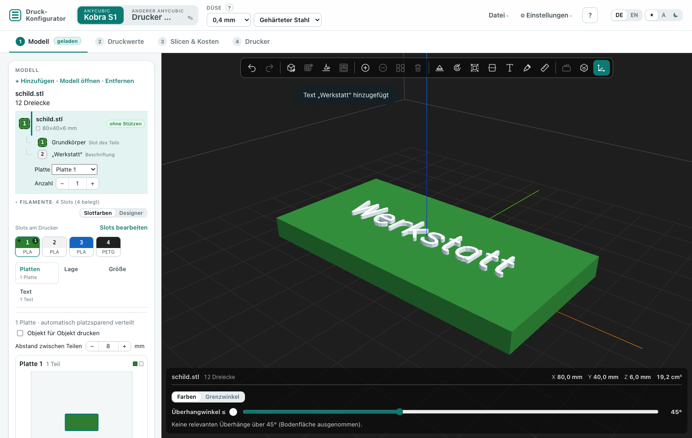

Unter **Beschriftung** in ① Modell setzt du Text auf das gewählte Teil:

- **Text** eingeben (eine Zeile, bis 60 Zeichen, auch Umlaute, € und °), **Höhe** (Standard 8 mm), **Tiefe** (1 mm), **Strichstärke** und **Drehung** (0/90/180/270°).
- **erhaben:** Die Schrift steht auf der Fläche und bekommt einen **eigenen Slot** – so druckst du sie in einer anderen Farbe (z. B. weiße Schrift auf schwarzem Schild).
- **vertieft:** Die Schrift wird in die Fläche eingelassen (OrcaSlicer zieht sie beim Slicen ab).
- Standard ist die oberste ebene Fläche; mit **Fläche wählen** klickst du in der 3D-Ansicht eine andere an (z. B. eine Seitenwand).
- Das Tool warnt, wenn der Text über die Fläche oder das Teil hinausragt oder die Striche zu dünn werden.

Die Schrift ist Hershey Simplex (frei nutzbar). Grenzen: nur ebene Flächen; bei Makerworld-3MF nur für hinzugefügte Teile, nicht für die Objekte des Designers.

### Mehrfarbig: mehrere Farben in einem Teil

Besteht ein Teil aus mehreren **Körpern**, zeigt der Schritt **① Modell** den Kasten **Mehrfarbig**. Körper sind:

- Körper einer STL, die sich berühren oder überlappen (z. B. Schrift auf einer Platte, Stiel und Hut),
- die Bauteile eines Objekts in einer 3MF (die Slots des Designers werden übernommen),
- Dateien, die du selbst vereint hast (siehe unten).

Jeder Körper bekommt über die Auswahl rechts einen eigenen **Slot** – und damit die Farbe, die in diesem Slot steckt. „wie Teil“ heißt: Er bekommt den Slot des Teils. Fährst du mit der Maus über eine Zeile, leuchtet der Körper in der Vorschau gelb auf; Der Umschalter **Farben | Grenzwinkel** unter dem Modell zeigt mit „Farben“ alle Körper in der Farbe ihres Slots (live vom Drucker oder aus deiner Belegung, sonst Ersatzfarben).

Steht dasselbe Objekt einer 3MF auf mehreren Platten, gilt die Farbwahl für **alle Platten** – Orca speichert sie je Objekt. Der Kasten nennt dann, auf welchen Platten das Objekt steht.

Ein Körper hat dieselben Werte wie sein Teil – gedacht ist das für Farbwechsel. In der 3MF wird jeder Körper ein eigenes Bauteil mit eigenem Slot; der Export-Dialog listet ihn unter dem Teil mit „↳“ auf.

**Mehrere Dateien zu einem Teil vereinen:** Viele mehrfarbige Modelle kommen als eine STL je Farbe, alle an derselben Stelle. Wähle eine Datei, dann unter **Mit Teil vereinen** die zweite und **Vereinen**. Die Lage aus den Dateien bleibt, eine Drehung wird zurückgesetzt. **In einzelne Teile trennen** macht das wieder rückgängig. Bei Makerworld-3MF gibt es beides nicht, dort bleiben die Objekte des Designers.

Hohlräume (die Innenwand eines Hohlkörpers) gelten nicht als eigener Körper. Körper, die sich Eckpunkte teilen (ein zusammenhängendes Netz), bleiben ein Körper – dann die Farben als getrennte Dateien exportieren.

### Farbwechsel und Abfall (Kobra S1)

Beim Kobra S1 spült die Firmware bei jedem Farbwechsel selbst in den Abfallschacht – der Slicer schreibt nur den Wechselbefehl. Der Export-Dialog zeigt deshalb bei mehrfarbigen Projekten eine Schätzung: **wie viele Farbwechsel**, wie viel **Abfall** und wie lange die Wechsel dauern. Die Zahl der Wechsel rechnet das Tool wie OrcaSlicer (mit der Orca-Kommandozeile verglichen); Abfall und Zeit stammen aus einer Messung mit PLA (100 Wechsel).

Die Menge stellst du **am Drucker** ein: Touchscreen, ACE-Menü, **Spülmenge** (0,1–3,0, ab Werk 1,5). Im Dialog wählst du unter **Spülmenge am Drucker**, was dort eingestellt ist – die Datei bekommt dann die passende Wechselzeit, damit Orca die Druckzeit richtig schätzt.

| Spülmenge | Abfall je Wechsel | Zeit je Wechsel | Ergebnis im Test |
|---|---|---|---|
| 1,5 (Werk) | ≈ 1,1 g | ≈ 2 min 6 s | sauber |
| **1,0 (empfohlen)** | ≈ 0,8 g | ≈ 1 min 47 s | genauso sauber, rund 30 % weniger Abfall |
| 0,5 | ≈ 0,45 g | ≈ 1 min 28 s | Farben mischen sich (Weiß wird rosa), Kleckse fallen teils aufs Bett |

Bei Schwarz → Weiß oder Silk-Filament eher 1,2–1,5. Am meisten spart, wer **weniger wechselt**: mehrere Teile gleichzeitig drucken (sie teilen sich die Wechsel jeder Schicht) und Farbe nur in wenigen Schichten einsetzen, z. B. Schrift oben auf einer Fläche statt durch die ganze Höhe.

---

## 5. Lage auf dem Bett

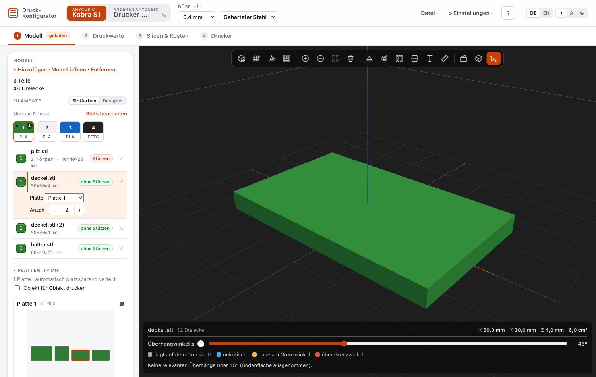

Unter **Lage auf dem Bett** bewertet das Tool, wie viele Stützen die aktuelle Lage braucht und wie viel Auflagefläche das Teil hat. Es prüft die großen ebenen Flächen des Teils als mögliche Auflage und schlägt eine bessere Lage vor, wenn sie deutlich weniger Stützen braucht.

- Stützen, die **auf dem Teil selbst** oder in Löchern stehen, zählen dreifach: Sie gehen schwerer ab und hinterlassen Spuren.
- Sehr wenig Auflagefläche (Kippgefahr) wird ebenfalls berücksichtigt.
- **Übernehmen** dreht das Teil in die vorgeschlagene Lage.
- **Fläche aufs Bett …** – wechselt in die 3D-Ansicht; die Fläche anklicken, die unten liegen soll (Esc bricht ab).
- **↻ X / ↻ Y / ↻ Z** – um 90° drehen. **Original** – Lage aus der Datei.
- Bei mehreren Teilen: **Alle Teile nach Vorschlag ausrichten**.
- Unter der Modell-Karte zeigt eine **kleine 3D-Vorschau** das gewählte Teil in seiner aktuellen Lage – rot eingefärbte Flächen brauchen Stützen. Ziehen dreht die Ansicht, das Mausrad zoomt.

Bei 3MF-Projekten bleibt die Lage des Designers erhalten; Drehen ist dort gesperrt.

### Bohrlöcher verstärken

Unter **Bohrlöcher verstärken** listet das Tool die runden Löcher des gewählten Teils auf – senkrecht und waagerecht, mit Durchmesser, Tiefe und Lage. Nichts wird automatisch geändert: Setze ein **Häkchen** bei den Löchern, die Last tragen (z. B. Schraubenlöcher). Beim 3MF-Export bekommt jedes angehakte Loch in Orca einen **Modifikator**: einen Ring von 3 mm rund um das Loch mit **100 % Füllung**. Dort ist das Teil dann massiv und verteilt die Last der Schraube besser.

- Nach einer Drehung wird neu erkannt, die Häkchen werden zurückgesetzt.
- Nur bei STL-Teilen; Makerworld-Projekte bleiben unverändert.
- In Orca erscheint der Modifikator unter dem Objekt als „Verstärkung Loch …“ und lässt sich dort anpassen oder löschen.

---

## 6. Einstellungen und Datenblatt

Links wählst du in Gruppen: **Filament** (mit den Farben des Herstellers), **Was wird gedruckt** (Objekt, Priorität, Belastung), **Stützen** (Support, Stützreduzierung) und – beim Kobra S1 – **Farbwechsel & Spülmenge** (die Spülmenge am Drucker; stand früher in ③). Die kleine 3D-Ansicht der Lage ist unten eingeklappt. Rechts steht das **Datenblatt** in drei Karten: **Temperatur & Kühlung** (Düse, Bett, Lüfter), **Tempo** (Wände, Füllung, Volumenstrom, Beschleunigung, Rückzug) und **Aufbau** (Schichthöhe, Wände, Deck/Boden, Füllung, Stützen, Brim); die **Hinweise** zeigen ihre Anzahl und sind offen, wenn es etwas zu beachten gibt – und aufklappbar:

- **Einstellungen in Slicer-Reihenfolge** – alle Werte in der Reihenfolge der Slicer-Registerkarten
- **Stützparameter** – alle Stützwerte (Abstände, Schnittstelle, Baum-Parameter)
- **Hinweise** – Warnungen, z. B. zu Material und Düse
- **OrcaSlicer-Import (JSON)** – Alternative zum 3MF-Export

**Wasserdicht / Behälter:** Diese Objektart setzt mindestens 4 Wandlinien, 5 Deck- und 6 Bodenschichten, 5 °C mehr Düsentemperatur, eine langsamere Außenwand und in Orca „Lückenfüllung überall“. Die Hinweise nennen weitere Tipps (Vasenmodus für einfache Gefäße, Epoxid-Beschichtung). Nicht für Trinkwasser oder Lebensmittel – nach dem Druck mit Wasser testen.

**Stützen:** Das Tool empfiehlt Baumstützen, wenn das Teil relevante Überhänge hat. Der Abstand zwischen Stütze und Teil entspricht einer Schichthöhe (PETG 0,05 mm mehr, weil es stärker haftet) – so halten die Stützen sicher und lassen sich trotzdem lösen.

**Düsen-Umrechnung:** Für 0,25/0,6/0,8 mm und andere Düsenmaterialien rechnet das Tool die Werte um. Der 3MF-Export ist derzeit nur mit der **0,4-mm-Düse** möglich.

---

**Einstellungen in Slicer-Reihenfolge:** Abschnitte einzeln aufklappbar; für diesen Auftrag angepasste Werte sind markiert (✎), **Nur angepasste Werte zeigen** blendet den Rest aus. Alle Stützwerte stehen im Abschnitt **Stützen**. Die Schritt-für-Schritt-Anleitung für den Slicer steht eingeklappt unter der Stützen-Empfehlung – beim 3MF-Export und Slicen im Tool sind die Werte schon eingetragen. Hinweise zum JSON-Export: unter **Datei → Weitere Exporte**.

**Handy:** Unter 640 px Breite ist die Kopfzeile kompakt, im Tab ① steht die 3D-Ansicht oben, Dialoge und Auswahllisten nutzen die ganze Breite.

### Werte für diesen Auftrag anpassen

Die Werte im Datenblatt sind ein **Vorschlag**. Willst du für diesen Druck etwas anders – z. B. mehr Wände, eine andere Füllung oder Stützen erzwingen –, klick über dem Datenblatt auf **✎ Werte für diesen Auftrag anpassen**:

- Links steht je Wert der **Vorschlag**, rechts trägst du deinen Wert ein. **Leer = Vorschlag.** Das **×** nimmt einen einzelnen Wert zurück, **Alle leeren** alle.
- Anpassen lassen sich: Düse und Heizbett (°C), Schichthöhe, Wandlinien, obere/untere Schichten, Fülldichte, Füllmuster (Gyroid, Kubisch, Gitter, Waben, Linien, Dreiecke, Kreuzschraffur, Blitz), Geschwindigkeit von Außenwand, Innenwand und Füllung, Lüfter, Stützen (an/aus), **Nur kritische Bereiche** (an/aus) und Brim.
- **Nur kritische Bereiche** ist als Vorschlag an: OrcaSlicer stützt dann nur Spitzen und Auskragungen, normale Überhänge nicht. Fehlen in der Vorschau Stützen unter Überhängen, schalte es hier aus.
- Die angepassten Werte gelten **überall**: im Datenblatt (orange markiert, mit dem Vorschlag daneben), in der 3MF, beim Slicen, in den Kosten und beim Drucken.
- Sie gelten **je Teil** – bei mehreren Teilen für das gewählte Teil (und alle Platzierungen desselben Objekts); **Für alle Teile des Projekts übernehmen** setzt sie für alle.
- Anders als **Werte anpassen** beim Filament (das ändert dein Filamentprofil dauerhaft) gilt die Anpassung nur für das geladene Projekt.

## 7. Eigene Filamentwerte und Profile

- **Werte anpassen** (unter der Filament-Auswahl oder im Menü **Profile**): eigene Temperatur, Geschwindigkeit, Lüfter usw. speichern. Alle Empfehlungen rechnen danach mit deinen Werten.
- **Neues Filament:** zusätzliches Profil, z. B. für eine bestimmte Marke.
- **Profile exportieren/importieren:** eigene Werte als Datei sichern oder auf einen anderen PC übertragen.

---

## 8. Drucker-Verbindung (Filament-Belegung live)

Unter **⚙ Einstellungen → Drucker-Verbindung** trägst du die IP-Adresse deines Druckers im Heimnetz ein, wählst die **Verbindung** und testest sie. Das Tool fragt dann beim Export die **tatsächliche Filament-Belegung** (Typ und Farbe je Slot) ab. Das Tool muss dafür über den Server laufen (Container oder `Konfigurator starten.cmd`).

### Kobra S1 mit Werksfirmware (LAN-Modus)

1. Am Drucker **Einstellungen → Netzwerk → LAN-Modus** einschalten. Im LAN-Modus ist der Drucker nicht mit der Anycubic-Cloud verbunden – die Anycubic-App kann ihn dann nicht fernsteuern.
2. Im Tool die IP-Adresse eintragen, **Verbindung: Automatisch** oder **Werksfirmware (LAN-Modus)**, **Testen**.

Das Tool meldet sich wie Anycubics eigener Slicer am Drucker an (Anmeldung über Port 18910, danach verschlüsselte Verbindung über Port 9883). Die Zugangsdaten wechselt der Drucker; das Tool speichert sie nicht. Möglich ist dann:

- **Belegung lesen** – Typ und Farbe je ACE-Slot, auch mehrere ACE-Einheiten.
- **Slot-Filament am Drucker ändern:** in den [Filament-Slots](#filament-slots) einen Slot überschreiben und **Überschriebene Slots auch in die ACE schreiben** anhaken – dann landet die Angabe in der ACE (wie am Touchscreen). Leere Slots lassen sich so nicht „leer setzen“.
- **Automatisch nachfüllen** (Runout-Nachschub aus einem anderen Slot) ein- oder ausschalten – erscheint nach einem erfolgreichen Test.
- **Rohdaten vom Drucker** ansehen (ohne die geheime Upload-Adresse).

Das Tool sendet **keine Druck-, Bewegungs- oder Heizbefehle** – nur diese Einstellungen. Die **Spülmenge** meldet die Firmware über diese Verbindung nach bisherigem Stand nicht; sie bleibt am Touchscreen (siehe [Farbwechsel und Abfall](#farbwechsel-und-abfall-kobra-s1)). Das Protokoll ist nicht von Anycubic dokumentiert, sondern nachvollzogen; ein Firmware-Update kann es ändern.

### Rinkhals/Moonraker

Mit **Verbindung: Rinkhals (Moonraker)** liest das Tool die Belegung über Moonraker (nur lesend). Das bringt eine Fremd-Firmware mit – nicht vom Hersteller, Installation und Nutzung auf eigene Verantwortung, Anleitung beim Projekt selbst:

- **Anycubic Kobra S1:** [Rinkhals](https://jbatonnet.github.io/Rinkhals/)
- **Snapmaker U1:** [Extended Firmware von paxx12](https://github.com/paxx12-snapmaker-u1/SnapmakerU1-Extended-Firmware)

Weiteres:

- Über Moonraker **liest** das Tool nur.
- **Automatisch** versucht zuerst den LAN-Modus, dann Moonraker.
- Ohne Verbindung trägst du die Belegung in den Filament-Slots selbst ein.

### Filamente von Anycubic und SUNLU

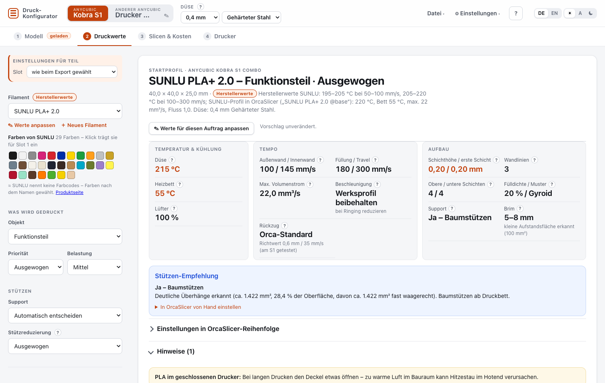

In ② **Druckwerte → Filament** sind die Filamente nach Hersteller gruppiert: **Anycubic** (PLA Basic, PLA+, PLA High Speed, Matte, Silk, Galaxy, Metal, Marble, Glow, PLA-CF, PETG, PETG Translucent, PETG-CF, ABS, ASA, TPU 95A), **SUNLU** (PLA, PLA+, PLA+ 2.0, Matte, Meta, Silk PLA+ und 2.0, die High-Speed-Sorten, PETG, PETG 2.0, High Speed Matte PETG, ABS, ASA, TPU 95A, PLA-CF, PETG-CF), dazu die allgemeinen Profile. Das Abzeichen **Herstellerwerte** zeigt, dass die Werte vom Hersteller stammen: bei Anycubic aus Anycubics eigenen Kobra-S1-Profilen (in OrcaSlicer mitgeliefert) bzw. von der Produktseite, bei SUNLU von den Produktseiten (Düsentemperatur je Tempo-Stufe, Bett) und aus SUNLUs eigenen Slicer-Profilen. Die genaue Quelle steht im Datenblatt. Wo ein Hersteller keine Werte nennt, steht das dort ebenfalls (dann gelten die Werte des nächstverwandten Profils).

**Passt das Filament nicht zum Slot** (z. B. PETG gewählt, im Slot steckt laut ACE PLA), steht direkt unter der Auswahl und in ③ vor dem Slicen ein roter Hinweis mit **Filament aus dem Slot übernehmen** – sonst würde mit den Temperaturen des falschen Materials gedruckt. Geprüft wird nur, wenn die Belegung bekannt ist (vom Drucker oder deine eigene Angabe).

Unter der Auswahl stehen die **Farben** des Herstellers – aber nur, wenn die ACE die Spule im Slot des Teils nicht per RFID erkannt hat (sonst ist die Farbe bekannt, und dort steht nur ein Hinweis). Ein Klick trägt Typ und Farbe für den Slot des gewählten Teils ein – wie im Dialog Filament-Slots (mit Drucker-Verbindung als „überschrieben“). Anycubics Farben tragen die Farbcodes aus Anycubics Shop; SUNLUs Farben tragen die Codes aus SUNLUs Farbtabellen auf sunlu.com; Shop-Farben ohne Eintrag dort sind ungefähr (≈, im Tooltip markiert).

### Filament-Slots

Im Schritt **③ Slicen & Kosten** zeigt der Abschnitt **Filament-Slots** jeden Slot mit Farbe, Material und Herkunft (vom Drucker, überschrieben, eigene Angabe) – ist eine Verbindung eingerichtet, liest das Tool die ACE beim Öffnen einmal aus. Darunter stellst du unter **Farbwechsel & Spülmenge** die Spülmenge ein und siehst die Schätzung für das geladene Projekt.

**Mit welchem Slot gedruckt wird:** Slot in der Liste anklicken – er ist dann mit „druckt damit“ markiert. Bei einem Teil (auch einem einfarbigen) gilt das für dieses Teil, bei mehreren Teilen als Standard für alle Teile ohne eigenen Slot. Passt das Filament des Teils nicht zum Slot (z. B. PLA-Profil, im Slot liegt ASA), stellt das Tool es passend um. Denselben Slot wählst du auch in **② Druckwerte** unter **Einstellungen für Teil → Slot**. **Für alle Teile übernehmen** (dort) bzw. **Slot N für alle Teile übernehmen** (unter der Slot-Liste) setzt einen Slot für alle Teile auf einmal; Körper mehrfarbiger Teile behalten ihre eigenen Slots.

Bearbeiten über **✎ Bearbeiten / überschreiben**, **⚙ Einstellungen → Filament-Slots …** oder **Slots bearbeiten** im Export-Dialog stellst du je Slot **Material und Farbe** ein.

- **Mit Drucker-Verbindung** zeigt jede Zeile, was die ACE meldet (mit RFID-Rollen automatisch richtig). Stimmt das nicht – z. B. Rolle ohne RFID-Chip, anderes Material als eingelesen –, hakst du **Überschreiben** an oder änderst einfach Material/Farbe (der Haken setzt sich dann selbst). Überschriebene Slots nehmen immer deine Angabe, auch nach dem nächsten Auslesen.
- **Ohne Verbindung** gilt, was du einträgst – bis du es änderst (z. B. nach einem Spulenwechsel).
- **Eigene Angaben löschen** nimmt alle Überschreibungen zurück.
- Mit der Werksfirmware kannst du überschriebene Slots zusätzlich **in die ACE schreiben**; danach meldet der Drucker sie selbst und die Überschreibung entfällt.

Die Slots bestimmen Filamenttyp und Farbe in der 3MF, die Vorauswahl im Export-Dialog und die Farben in der Vorschau (Umschalter „Farben“ unter dem Modell).

**Mehrere ACE-Einheiten:** Am Kobra S1 gehen bis zu **2 ACE** (8 Slots), andere Anycubic-Drucker mit ACE Pro 2 bis zu 4 (16 Slots). Die Slots zählen durch: ACE 2 hat die Slots 5–8 (in den Listen „Slot 5 · ACE 2“). Mit Verbindung erkennt das Tool die Anzahl selbst und merkt sie sich; ohne Verbindung stellst du sie im Dialog **Filament-Slots** unter **ACE-Einheiten** ein. 3MF, Slicen, Kosten, Filamentverwaltung und Home-Assistant-Sensoren nutzen dann alle Slots. Im Tab **④ Drucker** wählst du die Einheit über die Reiter **ACE 1 / ACE 2 …**; Laden, Trocknen und Temperatur gelten für die gewählte Einheit, „Automatisch nachfüllen“ für alle. *Hinweis:* Direkt drucken aus Slot 5–8 ist nur mit einer ACE am Drucker getestet – die Zuordnung (Slot 5 = ACE 2, Slot 1) folgt der Zählung des Druckers.

### Farbwechsel & Spülmenge einstellen

**⚙ Einstellungen → Farbwechsel & Spülmenge …** enthält dieselbe Einstellung wie der Export-Dialog: die **Spülmenge**, die am Drucker eingestellt ist. Zusätzlich kannst du **eigene Messwerte** eintragen – Abfall und Zeit je Farbwechsel, wenn dein Filament anders spült als die Referenzmessung. Selbst messen: Abfall nach einem mehrfarbigen Druck wiegen und durch die Zahl der Wechsel teilen. Die eigenen Werte gelten für die gewählte Spülmenge; wechselst du sie im Export-Dialog, verwirft das Tool sie.


### Kostenkalkulation

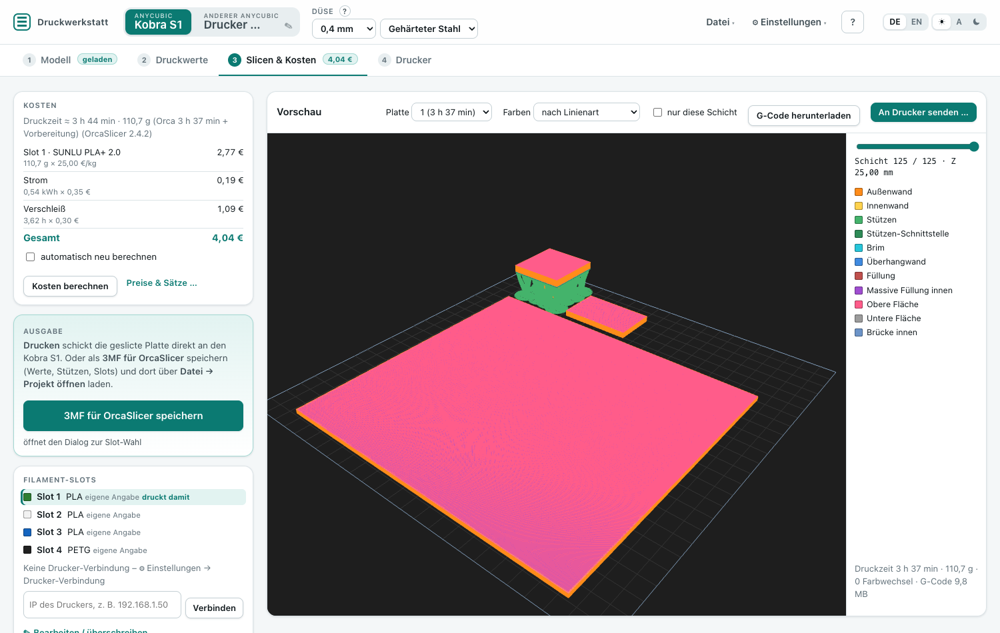

Im Schritt **③ Slicen & Kosten** unter **Kosten** steht der Preis des geladenen Projekts. Mit **automatisch neu berechnen** (Standard) rechnet das Tool nach jeder Änderung an Einstellungen oder Modell von selbst neu – kurz verzögert, damit mehrere Klicks nur einmal geslict werden; **Kosten berechnen** löst es von Hand aus. Das Tool baut dafür dieselbe 3MF wie beim Speichern und lässt sie auf dem Server **exakt mit OrcaSlicer slicen** – Verbrauch je Slot und Druckzeit kommen also aus Orca, nicht aus einer Schätzung. Das dauert je nach Modell Sekunden bis Minuten. Voraussetzung: das Tool läuft im Container (Orca ist dort enthalten) oder lokal mit installiertem OrcaSlicer.

| Posten | Rechnung |
|---|---|
| **Filament** je Slot | Gramm laut Orca × Preis des Filamenttyps in diesem Slot (inklusive Prime-Turm) |
| **Spülabfall** (Kobra S1) | Farbwechsel laut Orca × Abfall je Wechsel (aus „Farbwechsel & Spülmenge“) × mittlerer Filamentpreis |
| **Strom** | Leistung × Druckzeit × Strompreis |
| **Verschleiß** | Druckzeit × Satz je Stunde |
| **Aufschlag, MwSt.** | optional, z. B. wenn du für andere druckst |

Preise und Sätze stellst du unter **Preise & Sätze …** ein (auch **⚙ Einstellungen → Preise & Sätze …**): den **Preis je Filamenttyp** (PLA, PETG, ABS, ASA, TPU) und für alles andere, dazu Leistung, Strompreis, Verschleiß, Aufschlag und MwSt. Kostet ein einzelnes Filament mehr oder weniger als sein Typ, trägst du es unter „Abweichender Preis für einzelne Filamente“ ein. Slots ohne Filamentprofil – etwa Farben des Designers – rechnet das Tool mit dem Typ, den die ACE meldet. Änderst du dort etwas, rechnet das Tool sofort neu, ohne erneut zu slicen. Änderst du das Projekt (Filament, Slot, Lage …), steht beim Ergebnis **Veraltet** – dann neu berechnen.

Brauchen die Filamente zu unterschiedliche Temperaturen (z. B. PLA und ASA in einem Druck), slict Orca nicht; das Tool sagt das dann.

**Ladebalken:** Nach einer Änderung zeigt ein Balken oben im Tab ③, dass neu geslict wird – erst „Änderung erkannt“, dann der Fortschritt (geschätzt nach der Dauer der letzten Läufe; OrcaSlicer selbst meldet keinen), zuletzt „Lade Vorschau“. Rechnet das Tool im Hintergrund, während du in einem anderen Tab bist, dreht sich am Reiter „③ Slicen & Kosten“ ein kleiner Kreisel.

### Slice-Vorschau

Im Schritt **③ Slicen & Kosten** steht rechts die **Vorschau**: der geslicte G-Code als Schichtansicht – zum Prüfen, ohne OrcaSlicer zu öffnen. Sie lädt nach jedem Slicen neu.

- **Platte** wählen, mit dem **Schichtregler** (oder den Pfeiltasten ↑/↓) durch die Schichten gehen; **nur diese Schicht** zeigt eine einzelne.
- **Farben nach Linienart** (Außenwand, Füllung, Stützen, Reinigungsturm …) oder **nach Filament** – dann in den Farben deiner Slots (von der ACE gelesen). Sehr dunkles Filament erscheint grau, damit man es sieht.
- Einträge der Legende anklicken blendet sie aus und wieder ein.
- **G-Code herunterladen** speichert den G-Code der Platte – derselbe, den OrcaSlicer mit dieser 3MF erzeugt.

Die Vorschau zeigt nur Druckbahnen (keine Fahrwege). Das Tool hebt die letzten acht Slice-Aufträge auf; ältere muss man neu berechnen.

---

### Spulen & Restmengen (Filamentverwaltung)

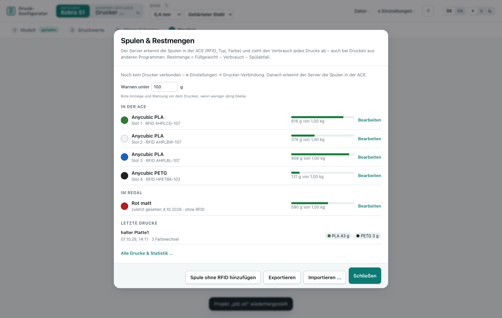

**⚙ Einstellungen → Spulen & Restmengen …** (oder der Link auf der ACE-Karte im Tab **Drucker**). Der Server erkennt die Spulen in der ACE selbst: an der RFID-Artikelnummer, am Typ und an der Farbe. Eine neue Spule legt er mit 1000 g an. Nimmst du eine heraus, wandert sie **ins Regal**; legst du sie wieder ein, erkennt er sie und rechnet weiter.

Die ACE meldet keine Restmenge. Die **Restmenge errechnet** das Tool: Füllgewicht − Verbrauch − Spülabfall.
- **Verbrauch:** Der Drucker meldet beim Drucken die verbrauchten Millimeter. Der Server rechnet sie über die Dichte des Filaments in Gramm um und zieht sie von der Spule ab, die gerade im Druckkopf steckt. Das gilt auch für Drucke aus dem Anycubic Slicer und wenn die Seite geschlossen ist; nur der Server muss laufen.
- **Spülabfall:** Bei jedem Farbwechsel kommt der Abfall im Schacht dazu, passend zu deiner Spülmenge.
- **Korrigieren:** Unter **Bearbeiten** trägst du die gewogene Restmenge ein (Gewicht mit Spule minus leere Spule). Dort stellst du auch das Füllgewicht (z. B. 750 g), Name, Marke und den **Preis je kg** ein. Der Preis geht in die Kosten ein.
- **Warnung:** Braucht der Druck mehr, als auf einer Spule ist, steht es in **③ Slicen & Kosten** und im Senden-Dialog.
- Spulen ohne RFID legst du mit **Spule ohne RFID hinzufügen** an. Leere Spulen kannst du **archivieren**.
- **Neue Spule erkannt:** Auf der ACE-Karte (④) und im Dialog erscheint „Neue Spule in Slot N erkannt – wie viel ist drauf?“ mit **Voll (1000 g)** oder **Restmenge eingeben …** – so beginnt die Rechnung mit dem richtigen Gewicht.
- **Warnen unter … g** (Standard 100 g): darunter wird die Anzeige rot, und vor dem Drucken warnt das Tool, wenn eine Spule nicht reicht („Zu wenig Filament“) oder danach unter die Schwelle fiele („Filament wird knapp“).
- **Exportieren / Importieren** überträgt die Spulen zwischen zwei Servern (z. B. vom Mac ins Home-Assistant-Add-on): **Zusammenführen** gleicht Spulen ab (neuerer Stand gewinnt) und fügt unbekannte hinzu, **Ersetzen** übernimmt alles.

- **Als Filamentprofil anlegen** (im Bearbeiten-Formular, wenn Marke oder Name eingetragen sind) macht aus der Spule ein eigenes Filamentprofil mit den Startwerten des Typs; „Filament aus dem ACE übernehmen“ nimmt dann dieses Profil.

Die Daten liegen auf dem Server in `~/.druck-konfigurator/spools.json`, im Container und im Home-Assistant-Add-on in `/data`.

### Druckhistorie & Statistik

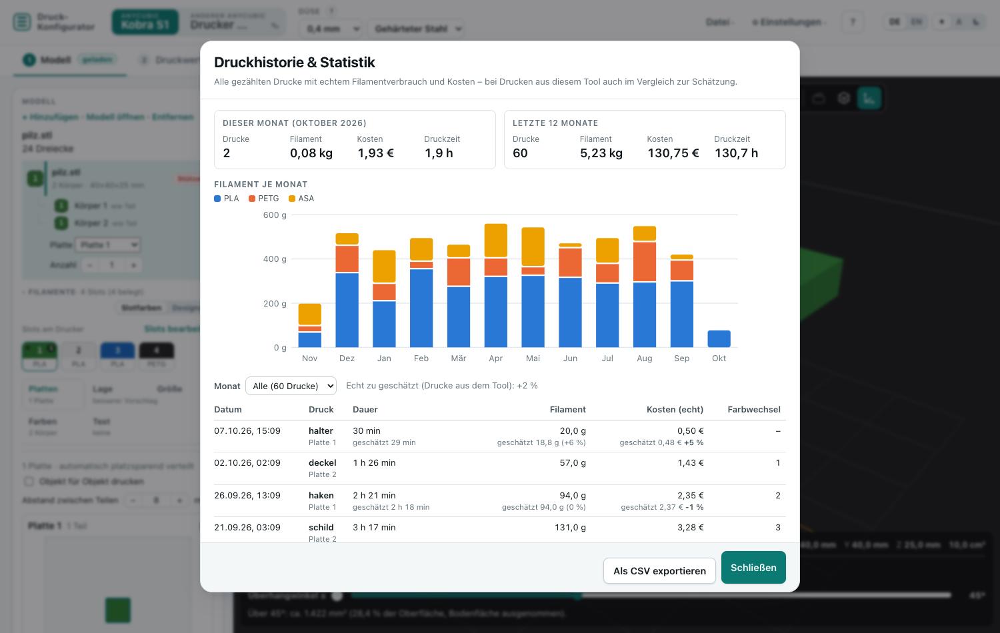

**⚙ Einstellungen → Druckhistorie & Statistik …** (oder **Alle Drucke & Statistik …** im Spulen-Dialog) zeigt alle gezählten Drucke:

- **Dieser Monat** und **letzte 12 Monate**: Anzahl, Filament, Kosten, Druckzeit; darunter der Filamentverbrauch je Monat nach Typ.
- Tabelle je Druck: Datum, Name, Dauer, Filament und **echte Kosten** (gezählter Verbrauch × Preis der Spule, sonst Standardpreis aus „Preise & Sätze“). Bei Drucken aus dem Tool steht die **Schätzung** aus ③ daneben mit der Abweichung in Prozent.
- Monat wählen (oder im Diagramm auf einen Balken klicken) filtert die Tabelle; **Als CSV exportieren** speichert sie für Excel.

Mit Home Assistant gibt es dazu die Sensoren **Filament diesen Monat**, **Kosten diesen Monat** und **Drucke diesen Monat**.

### Drucker-Werkbank (Tab „Drucker“)

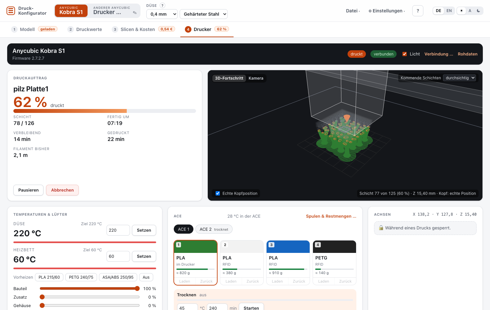

Mit der Werksfirmware im LAN-Modus steuerst du den Kobra S1 im Tab **Drucker** – das Tool muss über den Server laufen (Container oder `Konfigurator starten.cmd`). Ist noch keine Verbindung eingerichtet, fragt der Tab nach der IP-Adresse.

| Bereich | Was geht |
|---|---|
| **Druckauftrag** | Name, Fortschritt, Schicht, gedruckte und verbleibende Zeit – **Verbleibend** und **Fertig um** rechnet das Tool bei Drucken aus dem Tool selbst: Orcas Schätzung, verteilt auf die Schichten (mit den Farbwechseln) und ab der aktuellen Schicht aufsummiert, nach und nach ans gemessene Tempo angepasst; darunter klein der Wert des Druckers, dessen Schätzung oft stark springt; **Pausieren**, **Fortsetzen**, **Abbrechen** (mit Rückfrage). Der Reiter „Drucker“ zeigt den Fortschritt in Prozent. Darunter die **Objekte** des Drucks (bei mehreren Teilen): **Überspringen** lässt ein Teil ab sofort weg, z. B. wenn es sich gelöst hat – der Rest druckt weiter. Welches Teil gemeint ist, siehst du im 3D-Fortschritt: **Name anklicken** (oder mit der Maus darüber) hebt das Objekt **blau** hervor – als Block vom Bett bis zur aktuellen Schicht, die Markierung bleibt stehen (auch am Handy). **Überspringen** fragt in der Zeile nach (**Ja, überspringen** / **Nein**), das Objekt bleibt dabei blau sichtbar; ist gerade die Kamera an, wechselt die Ansicht zum 3D-Fortschritt. Übersprungene sind rot umrandet. Ein Objekt lässt sich auch direkt im 3D-Fortschritt anklicken (Ziehen dreht wie sonst) – dann steht die Rückfrage in der Liste. Ab der Schicht, in der es übersprungen wurde, sind seine Bahnen dunkel, und der Druckkopf fährt wie der Drucker gleich zum nächsten Objekt. In der Druckhistorie steht bei solchen Drucken „Objekt(e) übersprungen“ – der gezählte Verbrauch stimmt (er kommt aus dem, was der Drucker wirklich gefördert hat), nur die Schätzung enthält die übersprungenen Teile noch. Nur für Drucke aus dem Tool (die Objekte stehen im G-Code); „(gesendet)“ heißt, die Firmware hat nicht eigens bestätigt – in Kamera oder 3D-Fortschritt prüfen. |
| **3D-Fortschritt / Kamera** | Umschalter in der Karte: **3D-Fortschritt** zeigt den geslicten Druck bis zur aktuellen Schicht – fertige Schichten in Filamentfarbe, die aktuelle orange; die kommenden oben rechts unter **Kommende Schichten** durchsichtig (Standard), ausgeblendet oder voll. Der **Druckkopf** zeigt, wo gerade gedruckt wird. Mit **Echte Kopfposition** (unten links, Standard an) fragt der Server die Position auch während des Drucks alle 5 s ab: Der Kopf setzt sich auf die gemeldete Bahn und fährt zwischen zwei Meldungen mit den Geschwindigkeiten aus dem G-Code weiter (je Bahn, samt Beschleunigen, Bremsen und Kurven wie die Druckerfirmware; bei älteren Drucken aus den Druckereinstellungen je Linienart), Leerfahrten zwischen Teilen fährt er sichtbar ab; die Schicht kommt aus der gemeldeten Höhe, auf der aktuellen Schicht ist noch nicht Gedrucktes blass und färbt sich orange, sobald der Kopf darüber gefahren ist (auch bei der Schätzung; frühere Schichten in Filamentfarbe, sehr dunkle Farben aufgehellt), und unten rechts steht, wie weit die Schicht ist (z. B. „Schicht 77 von 125 (60 %)“). Bei Fahrten, beim Parken oder Reinigen gleitet der Kopf gerade zur gemeldeten Stelle. Dazu zeigt die Ansicht Druckbett, X-Traverse und Y-Schienen, die mit dem Kopf mitfahren; der Kopf hat etwa seine echte Größe (≈ 56 × 48 × 70 mm, geschätzt). Ist der Schalter aus, wird die Stelle geschätzt (Bahnen der Schicht in der erwarteten Schichtzeit). Drehen und zoomen mit der Maus. Nur für Drucke, die aus dem Tool gestartet wurden (der G-Code von Drucken aus anderen Programmen ist dem Tool nicht bekannt). **Kamera** zeigt das Live-Bild – es startet von selbst, sobald die Ansicht „Kamera“ offen und der Drucker verbunden ist (**Kamera stoppen** hält es an, bis du den Tab wieder öffnest; in der 3D-Ansicht läuft kein Kamerastrom; braucht einen Browser mit MSE – Chrome, Edge, Firefox, Safari am Mac). Kommen einige Sekunden keine neuen Bilder, steht das Alter des Bildes darüber; nach 6 s verbindet sich die Kamera neu, und wenn das Fenster wieder nach vorn kommt, startet sie frisch. |
| **Druckeinstellungen** | Zieltemperatur Düse und Bett (bis 300 / 110 °C), Vorheizen für PLA, PETG, ASA/ABS oder **Aus**, Bauteil-, Zusatz- und Gehäuselüfter, Licht. Die Druckgeschwindigkeit (Leise/Standard/Sport) wird angezeigt; ändern geht nur am Drucker. |
| **Achsen** | X/Y um 1, 10 oder 50 mm fahren, **Bett ↑ / Bett ↓** (beim Kobra S1 bewegt sich in Z das Bett: ↑ näher an die Düse), **⌂ XY** und **⌂ Z** referenzieren, Motoren aus. **Während eines Drucks gesperrt.** Nicht referenzierte Achsen fährt der Drucker nicht. |
| **ACE-Verwaltung** | Slots mit Material, Farbe und RFID; **Laden**/**Zurück** je Slot (während eines Drucks gesperrt), **Automatisch nachfüllen**, **Trocknen** mit Temperatur und Dauer. |
| **Drucker** | Modell, Firmware, IP, Zustand, Verbindung; **Rohdaten** zum Nachsehen. |

Das Tool fragt den Stand alle paar Sekunden ab, solange der Tab offen ist. Der Server hält eine Verbindung zum Drucker dauerhaft – für die Filamentzählung und die Warteschlange, auch wenn keine Seite offen ist. Jeder Befehl wird auf dem Server geprüft (erlaubte Befehle, Wertebereiche, Sperren während des Drucks).

**Nicht dabei**, weil nicht belegt: Druckgeschwindigkeit ändern, Dateien auf dem Drucker verwalten.

Drucke, die über LAN gestartet wurden (auch aus Anycubics Slicer oder diesem Tool), haben die Auftragsnummer −1 – das ist normal, Pause und Abbruch senden sie so.

### Direkt drucken

Im Schritt **③ Slicen & Kosten** startet **Drucken …** (unter Ausgabe, oder **An Drucker senden …** in der Vorschau) den Druck einer Platte, ohne OrcaSlicer zu öffnen:

1. **Platte** wählen. Der Dialog fragt den Drucker ab: frei? Ist er beschäftigt, lässt er sich nicht starten. Meldet er „beschäftigt“, obwohl kein Auftrag läuft (Kobra S1 oft nach einem Abbruch), wartet meist am Display ein Dialog – dort bestätigen oder den Drucker aus- und einschalten, dann **Erneut abfragen**.
2. Die Tabelle zeigt je Werkzeug im G-Code, aus welchem **ACE-Slot** gedruckt wird (Werkzeug T0 = Slot 1 usw.) und was dort steckt. Passt Material oder Slot nicht (leer, anderes Material), steht es rot da – die Temperaturen im G-Code gelten für das geslicte Material. Dann Filament tauschen oder **Filament aus der ACE übernehmen und neu slicen**: Das stellt die Teile auf das Filament in den Slots um, verwirft eigene Slot-Angaben, die der ACE widersprechen, slict neu und öffnet den Dialog wieder (gesendet wird erst auf deinen Klick). „Trotzdem drucken“ geht auf eigene Verantwortung.
3. **Bett automatisch vermessen** (empfohlen), optional **Flusskalibrierung** und **Zeitraffer**.
4. **Jetzt drucken** lädt den G-Code auf den Drucker und startet ihn; danach wechselt das Tool in den Tab **Drucker**.

**Mehrere Platten nacheinander:** **Alle Platten nacheinander …** legt im Tab **Drucker** eine **Warteschlange** in der empfohlenen Reihenfolge an. Du startest jede Platte selbst (**Drucken …**, mit derselben Slot-Prüfung). Ist sie fertig, meldet das Tool **„Platte 2 fertig – Bett abräumen“** – als Hinweis, mit ● im Fenstertitel und, wenn du es erlaubst, als Browser-Benachrichtigung (nur über `localhost` oder HTTPS). Danach mit einem Klick die nächste. Das Tool startet nie von selbst: Das Bett muss vorher leer sein. Oben steht die Restzeit aller Platten; **Überspringen**, **Nochmal** und **Beenden** (ein laufender Druck läuft weiter).

Die Warteschlange liegt **auf dem Server**: Er erkennt „Platte fertig“ auch, wenn keine Seite offen ist, und jede geöffnete Seite zeigt denselben Stand. Mit dem Home-Assistant-Add-on kommt die Meldung auch aufs Handy (siehe [Home Assistant](#home-assistant)).

Gedruckt wird genau der Stand der letzten Kostenberechnung. Hast du danach etwas geändert, erscheint **Drucken …** erst nach einer neuen Berechnung. Der Server prüft vor dem Start noch einmal, dass der Drucker frei ist und der G-Code für dieses Modell geslict wurde. Vor dem ersten Druck: Bett frei, richtige Druckplatte?

### Home Assistant

Als **Home-Assistant-Add-on** (Repository `https://github.com/TMA84/ha-addons`) läuft das Tool in der Seitenleiste von Home Assistant. In den Add-on-Einstellungen trägst du die **Drucker-IP** ein; die Seite verbindet sich damit von selbst. **access_pin** schützt den optionalen direkten Port 8765 mit einer PIN (der Weg über die Seitenleiste bleibt durch Home Assistant geschützt).

**3D-Fortschritt im Dashboard:** Die Adresse des Tools mit `?ansicht=3d` zeigt nur den 3D-Fortschritt des laufenden Drucks, bildschirmfüllend – als **Webseiten-Karte** im Dashboard: `/api/hassio_ingress/<Kennung des Add-ons>/?ansicht=3d` (die Kennung steht in der Adresszeile, wenn du das Add-on über die Seitenleiste öffnest).

Ist das MQTT-Add-on (Mosquitto) installiert, meldet das Tool automatisch Sensoren an Home Assistant (Gerät „Druck-Konfigurator Anycubic Kobra S1“):

| Sensor | Inhalt |
|---|---|
| Druckerzustand, Fortschritt, Restzeit, Fertig um, Auftrag, Schicht | laufender Druck |
| Düse, Heizbett | Temperaturen |
| Warteschlange, Restzeit Warteschlange, Platten fertig/gesamt | Warteschlange |
| **Bett abräumen** (an/aus) | an, sobald eine Platte der Warteschlange fertig ist – bis die nächste startet |
| Filament, Kosten und Drucke diesen Monat | aus der Druckhistorie |
| Slot 1–4 Restmenge | errechnete Restmenge der Spule in g (mit Name, Typ, Farbe) |

**Kamera „3D-Fortschritt“** (`camera.druck_konfigurator_progress`): ein Bild des laufenden Drucks – schräg von oben, gedruckte Schichten in den Farben der ACE-Slots, die aktuelle hell, dazu der Umriss des ganzen Modells. Neu bei jeder Schicht, nur für Drucke aus dem Tool. Es braucht keine Anmeldung am Add-on (anders als die eingebettete Seite) – geht also auch in der Handy-App und als Bild in Benachrichtigungen, z. B.:

```yaml
action: notify.mobile_app_mein_handy
data:
  title: 3D-Drucker
  message: "Fertig: {{ states('sensor.druck_konfigurator_job') }}"
  data:
    image: /api/camera_proxy/camera.druck_konfigurator_progress
```

Damit lassen sich Automationen bauen, z. B. eine Handy-Benachrichtigung bei **Bett abräumen** oder bei wenig Filament; ein Beispiel steht in der README des Add-ons. Ohne Home Assistant geht dasselbe mit einem eigenen MQTT-Broker (Umgebungsvariablen `MQTT_HOST`, `MQTT_PORT`, `MQTT_USER`, `MQTT_PASSWORD`).

## 9. 3MF für OrcaSlicer speichern

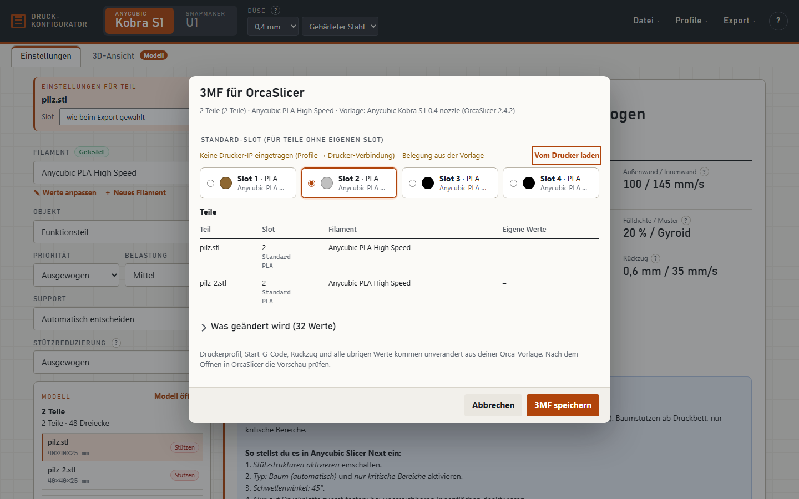

Die Datei öffnet auch der **AnycubicSlicerNext** (geprüft mit 1.4.1.1): gleiche Werte, Slots, Farben und Platten; Gramm und Druckzeit weichen wegen der älteren Orca-Basis leicht ab (im Test 8,1 statt 7,9 g, 51 statt 55 min). **Kosten im Slicer:** Die 3MF enthält deine Preise aus **Preise & Sätze** – Filamentpreis je Slot (`filament_cost`) und Maschinenkosten je Stunde (`time_cost` = Leistung × Strompreis + Verschleiß). Beide Slicer zeigen damit nach dem Slicen fast dieselben Kosten wie ③; Spülabfall der ACE, Aufschlag und MwSt. kennen sie nicht.

Der Knopf **„3MF für OrcaSlicer speichern“** im Schritt **③ Slicen & Kosten** unter **Ausgabe** (oder **Datei → 3MF für OrcaSlicer …**) öffnet den Dialog:

1. **Belegung prüfen** – was steckt in welchem Slot? **Slots bearbeiten** öffnet die [Filament-Slots](#filament-slots) (auch über **⚙ Einstellungen → Filament-Slots …**). Mit Drucker-Verbindung holt **Vom Drucker laden** die Belegung aus der ACE.
2. **Slot wählen** – bei einem Teil der Slot, bei mehreren der Standard-Slot für Teile ohne eigenen Slot.
3. Bei mehreren Teilen zeigt die Tabelle **Teil · Slot · Filament · eigene Werte**. Passt das Filament eines Teils nicht zum Slot, hilft **„Filament … passend zur Belegung wählen“**.
4. **Was geändert wird** – alle Werte, die gegenüber deiner Orca-Vorlage geändert werden.
5. **3MF speichern** – die Datei landet in deinem Download-Ordner, z. B. `modell_KobraS1_Slot2.3mf`.
6. Die Datei in OrcaSlicer über **Datei → Projekt öffnen** laden (nicht „Importieren“) und dort slicen – bei Rückfrage „Projekt-Einstellungen übernehmen“ wählen.

In der Datei stehen: Druckerprofil aus der Vorlage, die berechneten Filament- und Prozesswerte (auch Lüfter in der ersten Schicht und Z-Hop je Filament sowie die Beschleunigung, wenn das Datenblatt eine vorgibt). Der **Rückzug** bleibt beim Orca-Standard: Er hängt von Filament, Temperatur und Extruder ab, und das Orca-Filamentprofil des Slots bringt passende Werte mit, die Stützen, je Teil der Slot und abweichende Werte als **Objekt-Einstellung**. Mehrere Teile werden nebeneinander aufs Bett gelegt; passt nicht alles, kommt eine weitere Platte dazu.

> Die **Schichthöhe** gilt in Orca für die ganze Platte. Empfiehlt das Tool für einzelne Teile eine andere, steht das als Hinweis im Dialog.

---

## 10. Makerworld-Projekte umstellen

Viele Makerworld-3MFs sind für Bambu-Drucker eingestellt. Lädst du so eine Datei, zeigt **① Modell** „Ursprünglich für: …“. Beim Export:

- **bleiben erhalten:** Geometrie, Lage, Platten, Farbzuweisung und Bemalung des Designers,
- **werden ersetzt:** alle Drucker-, Filament- und Prozesseinstellungen durch dein S1- bzw. U1-Profil mit den berechneten Werten,
- **jede Platte** wird auf die Bettmitte deines Druckers gerückt.

Ist eine Platte größer als dein Bett, erscheint ein Hinweis.

---

## 11. 3D-Ansicht (Schritt ① Modell)

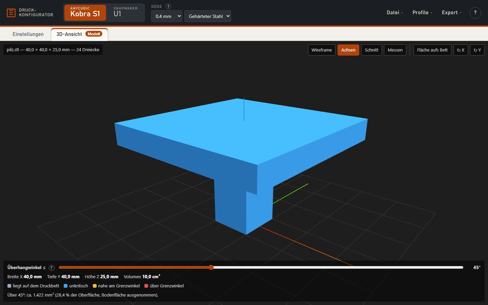

- Maus: **links ziehen** drehen, **rechts ziehen** verschieben, **Rad** zoomen.
- **Farben | Grenzwinkel** (unten, bleibt gemerkt): „Farben“ zeigt das Teil in Slot-, Körper- und Malfarben, so wie es gedruckt wird; „Grenzwinkel“ zeigt die Überhänge – blau unkritisch, gelb nahe am Grenzwinkel, rot darüber, grau liegt auf dem Bett. Beim Malen schaltet das Tool kurz auf „Farben“.
- **Überhangwinkel** (unten): Flächen steiler als dieser Winkel gelten als Überhang (rot in „Grenzwinkel“) und zählen für die Stützen-Entscheidung.
- **Wireframe**, **Achsen**, **Schnitt** (Schnittebene je Achse verschieben), **Messen** (zwei Punkte anklicken).
- **Fläche aufs Bett**, **↻ X**, **↻ Y** – wie in der Spalte daneben unter „Lage auf dem Bett“.
- Die Drahtbox zeigt den **Bauraum** des Druckers. Ist sie rot, passt das Teil nicht hinein (der Hinweis oben nennt Breite, Tiefe oder Höhe) – Teil drehen oder in OrcaSlicer skalieren/teilen.

---

## 12. Grenzen und bekannte Einschränkungen

- Getestet sind die Werte am **Kobra S1** mit PLA High Speed und TPU. Die **U1-Werte** sind übernommen und noch nicht am U1 gegengetestet – vorsichtig beginnen.
- 3MF-Export nur mit **0,4-mm-Düse** (dafür gibt es die Orca-Vorlagen).
- Bohrlöcher werden nur erkannt, wenn sie rund sind und entlang einer Achse des Teils verlaufen (bis etwa 3° Neigung). Schräge Löcher, Sechskant-Aussparungen für Muttern und Senkungen erscheinen nicht in der Liste.
- Die Überhang-Erkennung ist eine Geometrie-Näherung. Bei beschädigten Netzen (verdrehte Flächen) kann ein Überhang übersehen werden.

---

## 13. Probleme lösen

| Problem | Lösung |
|---|---|
| Fehlermeldung beim Laden nach einem Update, z. B. „… is not defined“ | Der Browser hat alte Dateien gespeichert. Einmal **Strg + F5** drücken. |
| „Drucker antwortet nicht“ | IP prüfen (⚙ Einstellungen → Drucker-Verbindung → Testen), Drucker eingeschaltet und im selben Netz? Das Tool muss über `Konfigurator starten.cmd` laufen. Der Kobra S1 antwortet manchmal langsam – **Vom Drucker laden** erneut klicken. |
| „Python wurde nicht gefunden“ | Python installieren (beim Setup „Add python.exe to PATH“ anhaken) oder `index.html` direkt öffnen. |
| Menüpunkt „3MF für OrcaSlicer“ ist grau | Zuerst ein Modell laden und die 0,4-mm-Düse wählen. |
| Werte in Orca weichen ab | Die 3MF über **Datei → Projekt öffnen** laden (nicht als Modell importieren – dann übernimmt Orca nur die Geometrie). |
| Eigene Filamentwerte sind weg | Werte hängen am Browser und an der Startart (Doppelklick vs. `Konfigurator starten.cmd`). Über **Profile exportieren/importieren** übertragen. |

---

*Druck-Konfigurator · Lizenz: CC BY-NC 4.0 (nur nicht-kommerziell) · Änderungen siehe [CHANGELOG.md](CHANGELOG.md)*
